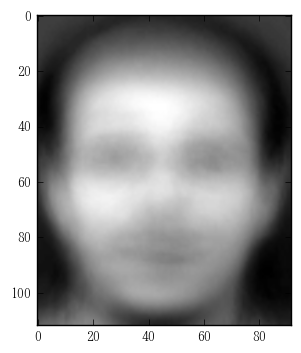

# Table of Contents
 <p><div class="lev1 toc-item"><a href="#Data-set;-The-Database-of-Faces" data-toc-modified-id="Data-set;-The-Database-of-Faces-1"><span class="toc-item-num">1&nbsp;&nbsp;</span>Data set; The Database of Faces</a></div><div class="lev2 toc-item"><a href="#Data-Sample" data-toc-modified-id="Data-Sample-11"><span class="toc-item-num">1.1&nbsp;&nbsp;</span>Data Sample</a></div><div class="lev2 toc-item"><a href="#Build-Data-Array" data-toc-modified-id="Build-Data-Array-12"><span class="toc-item-num">1.2&nbsp;&nbsp;</span>Build Data Array</a></div><div class="lev1 toc-item"><a href="#PCA" data-toc-modified-id="PCA-2"><span class="toc-item-num">2&nbsp;&nbsp;</span>PCA</a></div><div class="lev2 toc-item"><a href="#Image-Restoration" data-toc-modified-id="Image-Restoration-21"><span class="toc-item-num">2.1&nbsp;&nbsp;</span>Image Restoration</a></div><div class="lev2 toc-item"><a href="#Eigenface" data-toc-modified-id="Eigenface-22"><span class="toc-item-num">2.2&nbsp;&nbsp;</span>Eigenface</a></div><div class="lev1 toc-item"><a href="#KPCA" data-toc-modified-id="KPCA-3"><span class="toc-item-num">3&nbsp;&nbsp;</span>KPCA</a></div><div class="lev2 toc-item"><a href="#Image-Restoration" data-toc-modified-id="Image-Restoration-31"><span class="toc-item-num">3.1&nbsp;&nbsp;</span>Image Restoration</a></div>

# Data set; The Database of Faces


```python
!rm -rf ./data/
!ls
```

    README.md  main.ipynb


```python
import os
if not os.path.exists("./data/"):
    os.makedirs("./data/")
```


```python
!ls
```

    README.md  data       main.ipynb


> The files are in PGM format, and can conveniently be viewed on UNIX (TM) systems using the 'xv' program. The size of each image is 92x112 pixels, with 256 grey levels per pixel. The images are organised in 40 directories (one for each subject), which have names of the form sX, where X indicates the subject number (between 1 and 40). In each of these directories, there are ten different images of that subject, which have names of the form Y.pgm, where Y is the image number for that subject (between 1 and 10). Source : http://www.cl.cam.ac.uk/research/dtg/attarchive/facedatabase.html


```python
from six.moves.urllib import request
request.urlretrieve("http://www.cl.cam.ac.uk/Research/DTG/attarchive/pub/data/att_faces.zip","./data/att_faces.zip")
```


    ('./data/att_faces.zip', <http.client.HTTPMessage at 0x104ab2eb8>)


```python
!ls -d data/*
```

    data/att_faces.zip


```python
import zipfile
zip_ref = zipfile.ZipFile("./data/att_faces.zip", 'r')
zip_ref.extractall("./data/")
zip_ref.close()
```


```python
!ls -d data/*
```

    data/README        data/s18           data/s28           data/s38
    data/att_faces.zip data/s19           data/s29           data/s39
    data/s1            data/s2            data/s3            data/s4
    data/s10           data/s20           data/s30           data/s40
    data/s11           data/s21           data/s31           data/s5
    data/s12           data/s22           data/s32           data/s6
    data/s13           data/s23           data/s33           data/s7
    data/s14           data/s24           data/s34           data/s8
    data/s15           data/s25           data/s35           data/s9
    data/s16           data/s26           data/s36
    data/s17           data/s27           data/s37


```python
!ls -d data/s1/*
```

    data/s1/1.pgm  data/s1/2.pgm  data/s1/4.pgm  data/s1/6.pgm  data/s1/8.pgm
    data/s1/10.pgm data/s1/3.pgm  data/s1/5.pgm  data/s1/7.pgm  data/s1/9.pgm


## Data Sample


```python
from PIL import Image
import numpy as np
raw_im = Image.open('./data/s1/1.pgm').convert('L')
array_im = np.array(raw_im)
```


```python
raw_im
```


```python
print(array_im.shape)
print(array_im)
print(array_im.flatten())
```

    (112, 92)
    [[48 49 45 ..., 56 56 54]
     [45 52 39 ..., 52 50 51]
     [45 50 42 ..., 48 53 50]
     ..., 
     [50 48 50 ..., 45 46 46]
     [45 54 49 ..., 46 47 47]
     [51 51 51 ..., 47 46 46]]
    [48 49 45 ..., 47 46 46]


```python
Image.fromarray(array_im)
```


## Build Data Array


```python
number_of_person = 40
number_of_picture_per_person = 10
number_of_elements = array_im.shape[0] * array_im.shape[1] # 112*92
data = np.zeros((number_of_person * number_of_picture_per_person, number_of_elements))
```


```python
counter = 0
for i in range(number_of_person):
    for j in range(number_of_picture_per_person):
        data[counter] = np.array(Image.open("data/s{0}/{1}.pgm".format(i+1,j+1)).convert('L')).flatten()
        counter += 1
```


```python
mean_vec = np.mean(data, axis=0)
mean_vec
```


    array([ 85.6175,  85.5775,  85.925 , ...,  76.87  ,  75.865 ,  75.2275])


```python
std_vec = np.std(data, axis=0)
std_vec
```


    array([ 35.78325298,  35.68457641,  35.56268234, ...,  46.90056609,
            44.42585705,  43.95748791])


```python
for i in range(counter):
    data[i] = (data[i] - mean_vec) / std_vec
```


```python
data
```


    array([[-1.05125993, -1.02502268, -1.15078496, ..., -0.63687931,
            -0.67224364, -0.66490378],
           [-0.71590752, -0.71676625, -0.67275578, ..., -0.95670487,
            -0.94235661, -0.93789482],
           [-1.30277423, -1.16513923, -0.92583005, ..., -1.02066998,
            -1.12243192, -1.05164108],
           ..., 
           [ 1.10058468,  0.93660913,  1.07064477, ..., -0.87141805,
            -0.82980954, -0.8013993 ],
           [ 0.93290848,  0.96463244,  0.95816732, ...,  0.25863227,
             0.40820822,  0.22231707],
           [ 1.10058468,  1.07672569,  1.07064477, ..., -0.87141805,
            -0.9198472 , -0.93789482]])


```python
data.shape
```


    (400, 10304)


```python
1/400 * data.T @ data # 標本相関行列
```


    array([[ 1.        ,  0.99357094,  0.9924485 , ..., -0.0911466 ,
            -0.07055043, -0.03737454],
           [ 0.99357094,  1.        ,  0.9934313 , ..., -0.08966899,
            -0.06973336, -0.03728562],
           [ 0.9924485 ,  0.9934313 ,  1.        , ..., -0.08892552,
            -0.06679533, -0.03649965],
           ..., 
           [-0.0911466 , -0.08966899, -0.08892552, ...,  1.        ,
             0.92613359,  0.86433606],
           [-0.07055043, -0.06973336, -0.06679533, ...,  0.92613359,
             1.        ,  0.94076559],
           [-0.03737454, -0.03728562, -0.03649965, ...,  0.86433606,
             0.94076559,  1.        ]])


# PCA


```python
%matplotlib inline
import numpy as np
import sklearn.decomposition as decomp
import matplotlib.pyplot as plt
```


```python
pca = decomp.PCA()
pca.fit(data)
E = pca.explained_variance_ratio_
print(pca.components_.shape)
```

    (400, 10304)


## Image Restoration


```python
transformed_data = pca.transform(data)
transformed_data.shape
```


    (400, 400)


```python
def visualize_face(data):
    plt.imshow(Image.fromarray((std_vec * data + mean_vec).reshape(112,92).astype(np.uint8)), cmap='gray')
    plt.show()
```

Original Data


```python
visualize_face(data[0])
```


Image Restoration with limited principal components. It need 325 principal components to restore 95 percent data.


```python
index = 0
for i in np.cumsum(E):
    if i > 0.95:
        print(index)
        break
    index += 1
```

    191


```python
print("Image Restoration with {0} components. Cumulative contribution ratio is {1}.".format(pca.components_[:index].shape[0], np.cumsum(E)[index]))
visualize_face(transformed_data[0][:index] @ pca.components_[:index])
```

    Image Restoration with 191 components. Cumulative contribution ratio is 0.9500663577692849.


## Eigenface


```python
for i in range(10):
    print("Eigenface {0} with contribution {1}:".format(i+1, E[i]))
    visualize_face(transformed_data[0][i] * pca.components_[i])
```

    Eigenface 1 with contribution 0.1609679694800078:


    Eigenface 2 with contribution 0.1251016457589954:


    Eigenface 3 with contribution 0.0812922717481364:


    Eigenface 4 with contribution 0.05746099657145736:


    Eigenface 5 with contribution 0.0505572444688707:


    Eigenface 6 with contribution 0.030648331149216057:





    Eigenface 7 with contribution 0.023824003108218368:


    Eigenface 8 with contribution 0.02182406916226089:


    Eigenface 9 with contribution 0.020734888617777305:


    Eigenface 10 with contribution 0.019425488245887648:


# KPCA


```python
kpca = decomp.KernelPCA(n_components = index, kernel="poly", degree=20, fit_inverse_transform=True)
kpca.fit(data)
```


    KernelPCA(alpha=1.0, coef0=1, degree=20, eigen_solver='auto',
         fit_inverse_transform=True, gamma=None, kernel='poly',
         kernel_params=None, max_iter=None, n_components=191,
         remove_zero_eig=False, tol=0)


```python
print("第一主成分の寄与率",kpca.lambdas_[0]/np.sum(kpca.lambdas_))
print(kpca.lambdas_) # 固有ベクトルの値
```

    第一主成分の寄与率 0.233714304174
    [  6.89899157e+09   5.54779307e+09   2.85525345e+09   1.71391558e+09
       1.58150376e+09   1.08549049e+09   9.24325805e+08   8.33428294e+08
       8.11098127e+08   6.46012001e+08   6.22190812e+08   5.34228334e+08
       5.05358440e+08   4.99593599e+08   4.10489171e+08   3.09014480e+08
       3.04262491e+08   2.45201572e+08   2.36757445e+08   2.28990174e+08
       2.06891538e+08   1.99742921e+08   1.73493936e+08   1.65767833e+08
       1.53831524e+08   1.43245214e+08   9.91219067e+07   8.76940710e+07
       8.54300654e+07   7.23747130e+07   6.77426457e+07   5.56196108e+07
       5.41073373e+07   4.48185023e+07   4.16523880e+07   3.33183085e+07
       3.24109342e+07   3.12116174e+07   3.10549627e+07   3.05598805e+07
       2.88286406e+07   2.84738056e+07   2.77554265e+07   2.76931927e+07
       2.66561852e+07   2.36743743e+07   2.18453876e+07   2.10965722e+07
       2.09072806e+07   2.04842353e+07   1.86025749e+07   1.82852138e+07
       1.70686403e+07   1.69783919e+07   1.67372388e+07   1.52513171e+07
       1.45029465e+07   1.42472830e+07   1.41623388e+07   1.39975458e+07
       1.31355319e+07   1.27305311e+07   1.24289294e+07   1.24165230e+07
       1.23419028e+07   1.23353714e+07   1.22332813e+07   1.08475955e+07
       1.04858767e+07   1.03470021e+07   9.98450415e+06   9.78766995e+06
       9.65206181e+06   9.38418424e+06   9.34778197e+06   9.23301807e+06
       8.61280904e+06   8.17955656e+06   7.61581767e+06   7.46945934e+06
       6.96523112e+06   6.70851867e+06   6.61042093e+06   6.45979131e+06
       5.95549481e+06   5.89915807e+06   5.79094338e+06   5.72694180e+06
       5.68035284e+06   5.61655659e+06   5.49995922e+06   5.46503745e+06
       5.40442576e+06   5.28975774e+06   5.27094587e+06   5.23996467e+06
       5.20307122e+06   5.11623923e+06   5.09705901e+06   4.92174070e+06
       4.89023959e+06   4.61581888e+06   4.56581189e+06   4.22861244e+06
       4.07227167e+06   4.01403900e+06   3.51103377e+06   3.49201629e+06
       3.46750103e+06   3.44142874e+06   3.41514452e+06   3.33222764e+06
       3.19344718e+06   3.16030935e+06   3.08926993e+06   3.07606493e+06
       3.04975016e+06   3.04360124e+06   2.98805530e+06   2.94636715e+06
       2.75988134e+06   2.74388101e+06   2.70919645e+06   2.69430914e+06
       2.68474318e+06   2.60425491e+06   2.56732416e+06   2.51667054e+06
       2.45246261e+06   2.36071142e+06   2.30550951e+06   2.29433262e+06
       2.25402732e+06   2.18448319e+06   2.11479260e+06   2.08448593e+06
       2.06406703e+06   2.05099277e+06   1.99957759e+06   1.99255654e+06
       1.96974041e+06   1.95680459e+06   1.94666395e+06   1.93308577e+06
       1.86225594e+06   1.83967587e+06   1.80637830e+06   1.79005457e+06
       1.76168456e+06   1.74436191e+06   1.72773105e+06   1.57782182e+06
       1.55852247e+06   1.54158188e+06   1.51901407e+06   1.48751909e+06
       1.46711629e+06   1.46390490e+06   1.44385553e+06   1.41651144e+06
       1.40011422e+06   1.37936357e+06   1.30500524e+06   1.30317836e+06
       1.24932740e+06   1.24265705e+06   1.23226597e+06   1.16985363e+06
       1.15938704e+06   1.13681773e+06   1.12416447e+06   1.11298858e+06
       1.10792586e+06   1.09616168e+06   1.08492775e+06   1.06231473e+06
       1.01870931e+06   9.70559122e+05   9.58666297e+05   9.33422327e+05
       9.09608774e+05   8.98249536e+05   8.96355235e+05   8.88058852e+05
       8.76109849e+05   8.61818738e+05   8.32648861e+05   8.15449449e+05
       7.75758780e+05   7.73609770e+05   7.61068426e+05]


## Image Restoration


```python
transformed_data = kpca.transform(data)
restored_data = kpca.inverse_transform(transformed_data)
```

With kernel, we can restore 95 percent data with only 29 principal components.


```python
limit = 0
index = 0
for i in kpca.lambdas_:
    limit += i/np.sum(kpca.lambdas_)
    index +=1
    if limit > 0.95:
        print(index)
        break
```

    29


Image restration with 191 principal components and this clearly shows that these principal components are more superior to previous ones.


```python
visualize_face(restored_data[0])
```


